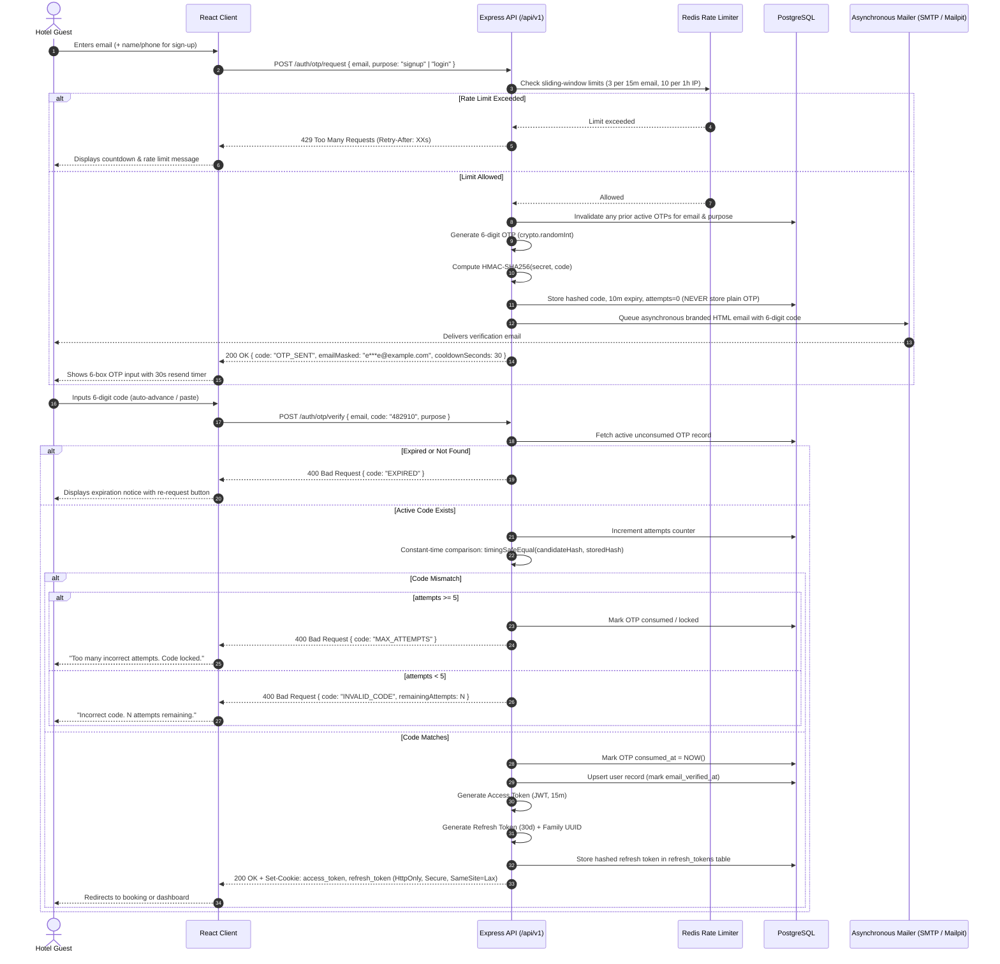
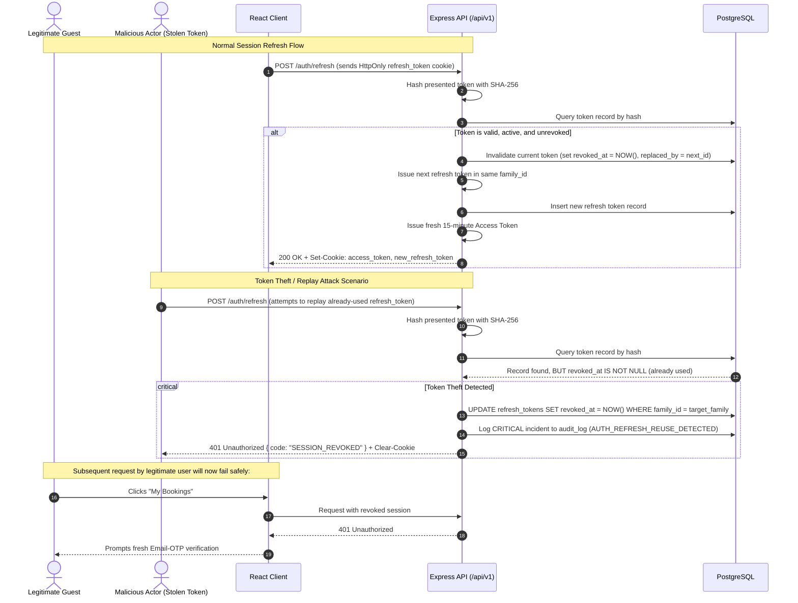

# Harbour Inn Authentication Sequence Diagrams

## 1. Passwordless Sign Up & Login with Email-OTP

```mermaid
sequenceDiagram
    autonumber
    actor Guest as Hotel Guest
    participant Web as React Client
    participant API as Express API (/api/v1)
    participant Rate as Redis Rate Limiter
    participant DB as PostgreSQL
    participant Mail as Asynchronous Mailer (SMTP / Mailpit)

    Guest->>Web: Enters email (+ name/phone for sign-up)
    Web->>API: POST /auth/otp/request { email, purpose: "signup" | "login" }
    
    API->>Rate: Check sliding-window limits (3 per 15m email, 10 per 1h IP)
    alt Rate Limit Exceeded
        Rate-->>API: Limit exceeded
        API-->>Web: 429 Too Many Requests (Retry-After: XXs)
        Web-->>Guest: Displays countdown & rate limit message
    else Limit Allowed
        Rate-->>API: Allowed
        API->>DB: Invalidate any prior active OTPs for email & purpose
        API->>API: Generate 6-digit OTP (crypto.randomInt)
        API->>API: Compute HMAC-SHA256(secret, code)
        API->>DB: Store hashed code, 10m expiry, attempts=0 (NEVER store plain OTP)
        API->>Mail: Queue asynchronous branded HTML email with 6-digit code
        Mail-->>Guest: Delivers verification email
        API-->>Web: 200 OK { code: "OTP_SENT", emailMasked: "e***e@example.com", cooldownSeconds: 30 }
        Web-->>Guest: Shows 6-box OTP input with 30s resend timer
    end

    Guest->>Web: Inputs 6-digit code (auto-advance / paste)
    Web->>API: POST /auth/otp/verify { email, code: "482910", purpose }
    
    API->>DB: Fetch active unconsumed OTP record
    alt Expired or Not Found
        API-->>Web: 400 Bad Request { code: "EXPIRED" }
        Web-->>Guest: Displays expiration notice with re-request button
    else Active Code Exists
        API->>DB: Increment attempts counter
        API->>API: Constant-time comparison: timingSafeEqual(candidateHash, storedHash)
        alt Code Mismatch
            alt attempts >= 5
                API->>DB: Mark OTP consumed / locked
                API-->>Web: 400 Bad Request { code: "MAX_ATTEMPTS" }
                Web-->>Guest: "Too many incorrect attempts. Code locked."
            else attempts < 5
                API-->>Web: 400 Bad Request { code: "INVALID_CODE", remainingAttempts: N }
                Web-->>Guest: "Incorrect code. N attempts remaining."
            end
        else Code Matches
            API->>DB: Mark OTP consumed_at = NOW()
            API->>DB: Upsert user record (mark email_verified_at)
            API->>API: Generate Access Token (JWT, 15m)
            API->>API: Generate Refresh Token (30d) + Family UUID
            API->>DB: Store hashed refresh token in refresh_tokens table
            API-->>Web: 200 OK + Set-Cookie: access_token, refresh_token (HttpOnly, Secure, SameSite=Lax)
            Web-->>Guest: Redirects to booking or dashboard
        end
    end
```

---

## 2. Refresh Token Rotation & Theft/Reuse Revocation

```mermaid
sequenceDiagram
    autonumber
    actor Guest as Legitimate Guest
    actor Attacker as Malicious Actor (Stolen Token)
    participant Web as React Client
    participant API as Express API (/api/v1)
    participant DB as PostgreSQL

    Note over Guest,API: Normal Session Refresh Flow
    Web->>API: POST /auth/refresh (sends HttpOnly refresh_token cookie)
    API->>API: Hash presented token with SHA-256
    API->>DB: Query token record by hash
    alt Token is valid, active, and unrevoked
        API->>DB: Invalidate current token (set revoked_at = NOW(), replaced_by = next_id)
        API->>API: Issue next refresh token in same family_id
        API->>DB: Insert new refresh token record
        API->>API: Issue fresh 15-minute Access Token
        API-->>Web: 200 OK + Set-Cookie: access_token, new_refresh_token
    end

    Note over Attacker,API: Token Theft / Replay Attack Scenario
    Attacker->>API: POST /auth/refresh (attempts to replay already-used refresh_token)
    API->>API: Hash presented token with SHA-256
    API->>DB: Query token record by hash
    DB-->>API: Record found, BUT revoked_at IS NOT NULL (already used)
    
    critical Token Theft Detected
        API->>DB: UPDATE refresh_tokens SET revoked_at = NOW() WHERE family_id = target_family
        API->>DB: Log CRITICAL incident to audit_log (AUTH_REFRESH_REUSE_DETECTED)
        API-->>Attacker: 401 Unauthorized { code: "SESSION_REVOKED" } + Clear-Cookie
    end

    Note over Guest,Web: Subsequent request by legitimate user will now fail safely:
    Guest->>Web: Clicks "My Bookings"
    Web->>API: Request with revoked session
    API-->>Web: 401 Unauthorized
    Web-->>Guest: Prompts fresh Email-OTP verification
```
